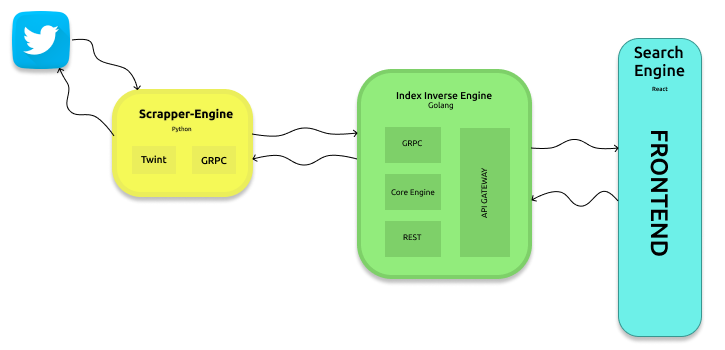

# Inverse index Twitter Search

El presente proyecto trata de scrappear la pagina de twitter dado un hashtag, seguido a eso tokeniza las palabras mas importantes y las muestra en una interfaz amigable.

# Dependencias
    - Go
    - Python
    - Node
  
# Ejecutar

El proyecto usa una comunicacion entre el servicio de go y de python usando grpc y de go hacia el cliente en react usando rest es por esto que para poder levantar el proyecto tendras que ejecutar los 3 servicios

para el de go, entrar a la carpeta index-invert:

      $ go build && ./indexInvert

para el de python, entrar a la carpeta:

     $ python3 index.py

para el front, entrar a la carpeta search-engine:

     $ npm install && npm run start
  
o también puedes correr el docker-compose.

     $ docker-compose up

# Arquitectura

El proyecto tiene un pequeño approach de micro servicios teniendo en cuenta las dependencias de cada uno.

- Scrapper Engine: Encargado de scrappear los datos de twitter para seguidamente ser procesados
- Index inverse engine: Encargado de procesar la data, tokenizar, filtrar por stopwords y brindar las estructuras que se manjearan en el fronted, estos datos se guardan en disco, por lo que su persistencia queda explicita.
- Search engine: Frontend, encargado de recibir y manejar las peticiones.

 

# Client

El cliente esta compuesto por una interfaz en la que puedes preguntar por hashtags y hacer un filtrado por palabras relevantes.

# Autores

- Miguel Yurivilca
- Antonio Toche

# Librerías usadas
- React
- Gin
- Twint
- Grpc
- Node
- otras...